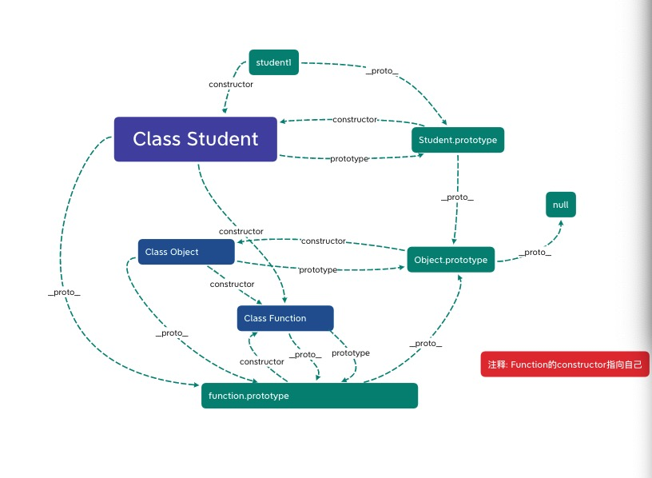

# JavaScript八股文

# 如何理解作用域?

## 答: 作用域可以被分为三种，全局作用域 ｜ 函数作用域 ｜ 块级作用域。

### 全局作用域: 任何不在函数内声明的变量或者在打括号内声明的变量都会在全局作用域内存放

### 函数作用域: 在函数体内部声明的变量在全局内是无法访问到的，只能够在当前函数体内使用该变量

### 块级作用域: 在大括号内使用Es6语法let/const声明的变量是无法在大括号外部进行访问该变量的

### 查询变量的顺序: 当前作用域 -> 当前作用域上层 -> ... -> 全局作用域

```
    var name = "CodeGorgeous"
    function print() {
        // 如果有第19行代码则打印出的name值为xingjun
        // var name = 'xingjun'
        function getName() {
            console.log(name) // CodeGorgeous
        }
        getName()
    }
    print()
```

# == 和 === 的区别? 分别在什么情况下使用?

## 答: ==会进行类型转换进行比较, ===是不会进行类型转换直接进行比较的。除了值为null或者undefined的情况下用相等，建议其他情况下采用全等

```
    const obj1 = {
        a: 1
    }
    const obj2 = obj1
    const obj3 = {
        a: 1
    }
    // == 相等
    console.log(true == 1) // true
    console.log(false == 0) // true
    console.log('1' == 1) // true
    console.log(null == null) // true
    console.log(undefined == undefined) // true
    console.log(null == undefined) // true
    console.log(NaN == NaN) // false
    console.log(NaN == null) // false
    console.log(NaN == undefined) // false
    console.log(obj1 == obj2) // true 引用类型比较的是地址
    console.log(obj1 == obj3) // false

    // === 全等
    console.log(true === 1) // false
    console.log(false === 0) // false
    console.log('1' === 1) // false
    console.log(1 === 1) // true
    console.log(null === null) // true
    console.log(undefined === undefined) // true
    console.log(null === undefined) // false
    console.log(NaN === NaN) // false
    console.log(NaN === null) // false
    console.log(NaN === undefined) // false
    console.log(obj1 === obj2) // true 引用类型比较的是地址
    console.log(obj1 === obj3) // false
```

# 如何理解原型? 原型链?

## 答: 此回答不固定，请看图自行理解在进行回答

### 一张图帮你理解原型链

```
    class Student {
        constructor(name) {
            this.name = name
        }
    }
    const student1 = new Student('CodeGorgeous')
```



# 如何理解闭包?

## 答: 闭包就是使一个嵌套函数能够访问到外层函数,可以用于创建私有化变量, 延长变量的生命周期

### 闭包的特点: 函数嵌套函数, 嵌套函数可以引用外层函数的参数, 函数执行完毕后其内部变量不会销毁(原始作用域链不释放,造成内存泄露)

```
    function print() {
        const name = 'xingjun'
        return function () {
            console.log(name)
        }
    }
    const result = print() // 正常函数在执行完毕后会销毁其内部参数
    result() // xingjun     在闭包中则会保留其执行期上下文, 不会销毁掉其上下文

    function print2() {
        let i = 0
        return function() {
            console.log(i++)
        }
    }
    const result1 = print2() // 
    result1()
    result1()
    const result2 = print2() // 如果再次调用是不会受到之前影响的
    result2()
    result2()
```
### 闭包的常见问题及其解决方案
```
    function print3() {
        let arr =[]
        for(var i = 0; i < 10; i++) {
            arr[i] = function() {
                console.log(i)
            }
        }
        return arr
    }
    const result3 = print3()
    for(let i = 0; i < result3.length; i++) {
        result3[i]() // 会打印出的值都为10
    }

    // 第一种解决方法:
    // 使用立即执行函数
    function print4() {
        let arr =[]
        for(var i = 0; i < 10; i++) {
            (function(j) {
                arr[j] = function() {
                    console.log(j)
                }
            })(i)
        }
        return arr
    }
    const result4 = print4()
    for(let i = 0; i < result4.length; i++) {
        result4[i]() // 0 1 2 3 4 5 6 7 8 9
    }

    // 第二种解决方法:
    // 使用es6都let
    // 为什么let能够解决这种问题?
    //  原因: let是存在块级作用域的, 每次遍历会产生新的作用域, 作用域之间不会互相影响
    function print5() {
        let arr =[]
        for(let i = 0; i < 10; i++) {
            arr[i] = function() {
                console.log(i)
            } 
        }
        return arr
    }
    const result5 = print5()
    for(let i = 0; i < result5.length; i++) {
        result5[i]() // 0 1 2 3 4 5 6 7 8 9
    }
```

# 如何理解继承? 怎么能够实现继承?

## 答: 继承可以理解为B继承了A, 那么A就是B的父类, B就是A的子类

### 继承的优势: 可以少写许多不必要的重复的方法和属性, 子类可以使用到父类的属性和方法, 也可以自己对其一些方法和属性进行重写

### ES6继承演示
```
    class People{
        constructor(name,phone) {
            this.name = name
            this.phone = phone
        }
        // 写
        write(content) {
            return content
        }
        // 读
        read() {
            return `我叫${this.name},我的电话为${this.phone}`
        }
    }

    // Male继承People
    class Male extends People{
        constructor(name,phone) {
            super(name,phone)
            this.sex = '男'
        }
        // 可以自己对其父类的方法进行重写,但是不会影响到父类
        read() {
            return `我叫${this.name},我是个${this.sex}孩子,我的电话为${this.phone}`
        }
        // 自己新增的独有的方法
        song() {
            return `
            See You Again
            It's been a long day without you my friend
            And I'll tell you all about it when I see you again
            We've come a long way from where we began
            Oh I'll tell you all about it when I see you again
            `
        }
    }
    const male = new Male('CodeGorgeous','176xxxxx940')
    console.log(male.write('集中一点,登峰造极')) // 芜湖起飞🛫️
    console.log(male.read()) // 我叫CodeGorgeous,我是个男孩子,我的电话为176xxxxx940
    console.log(male.song()) // See You Again ...... Oh I'll tell you all about it when I see you again

    class WoMan extends People{
        constructor(name,phone) {
            super(name,phone)
            this.sex = '女'
        }
        // 自己新增的独有的方法
        read() {
            return `我叫${this.name},我是个${this.sex}孩子,我的电话为${this.phone}`
        }
        // 
        dance() {
            return `💃💃💃💃💃💃💃💃💃💃💃💃💃💃💃💃💃💃`
        }
    }
    const woman = new WoMan('maomao','178xxxxx066')
    console.log(woman.write('蜡笔小新')) // 蜡笔小新
    console.log(woman.read()) // 我叫maomao,我是个女孩子,我的电话为178xxxxx066
    console.log(woman.dance()) // 💃💃💃💃💃💃💃💃💃💃💃💃💃💃💃💃💃💃
```

### 实现继承的方式

#### 寄生组合式继承

#### Es6的继承基本类似于寄生组合式继承

```
    // 实现寄生组合式继承
    function People(name,phone) {
        this.name = name
        this.phone = phone
    }
    People.prototype.write = function(content) {
        return content
    }
    People.prototype.read = function() {
        return `我叫${this.name},我的电话为${this.phone}`
    }

    function Male(name,phone) {
        People.call(this,name,phone)
        this.sex = '男'
    }
    Male.prototype = Object.create(People.prototype)
    Male.prototype.constructor = Male

    Male.prototype.read = function() {
        return `我叫${this.name},我是个${this.sex}孩子,我的电话为${this.phone}`
    }
    Male.prototype.song = function() {
            return `
                See You Again
                It's been a long day without you my friend
                And I'll tell you all about it when I see you again
                We've come a long way from where we began
                Oh I'll tell you all about it when I see you again
            `
    }
    const male = new Male('CodeGorgeous','176xxxxx940')
    console.log(male.write('集中一点,登峰造极')) // 集中一点,登峰造极
    console.log(male.read()) // 我叫CodeGorgeous,我是个男孩子,我的电话为176xxxxx940
    console.log(male.song()) // See You Again ...... Oh I'll tell you all about it when I see you again

    function WoMan(name,phone) {
        People.call(this,name,phone)
        this.sex = '女'
    }
    WoMan.prototype = Object.create(People.prototype)
    WoMan.prototype.constructor = WoMan
    WoMan.prototype.read = function() {
        return `我叫${this.name},我是个${this.sex}孩子,我的电话为${this.phone}`
    }
    WoMan.prototype.dance = function() {
        return `💃💃💃💃💃💃💃💃💃💃💃💃💃💃💃💃💃💃`
    }
    const woman = new WoMan('maomao','178xxxxx066')
    console.log(woman.write('蜡笔小新')) // 蜡笔小新
    console.log(woman.read()) // 我叫maomao,我是个女孩子,我的电话为178xxxxx066
    console.log(woman.dance()) // 💃💃💃💃💃💃💃💃💃💃💃💃💃💃💃💃💃💃
```

# 如何理解this指向?

**注意: 这里只讨论非严格模式下**

## 答: this的指向在函数创建阶段是无法确定的, 在绝大多数的情况下是谁调用了this就指向谁

### 其他情况:

```
    let obj = {
        a: 1,
        b: {
            a: 2,
            print() {
                console.log(this.a)
            }
        }
    }
    obj.b.print() // 2 // this不会产生作用域链这样形式的存在,就只会根据上一级的对象
    const result = obj.b.print
    result() // undefined 为什么这里会指向Window? 因为仔细看现在调用该函数的环境已经处于Window中,或者说result已经处于Window环境中

    // 特殊的一种例子
    function print(name) {
        this.name = name
        return
    }
    const print1 = new print('CodeGorgeous') // 注意点: new关键词会改变this指向, 会指向实例对象(返回一个引用类型(null)例外)
    console.log(print1.name) // xingjun 当函数返回值为一个引用类型(null除外)的时候, this会指向到返回的对象内
```

# 如何理解执行期上下文和执行栈?

## 答: 执行期上下文分为全局执行期上下文、函数执行期上下文、Eval执行期上下文(比较特殊的一个). 执行栈也叫做调用栈, 用于存储执行期上下文

### 执行期上下文存在生命周期: 创建阶段 -> 执行阶段 -> 回收阶段 

### 执行栈会在代码开始运行的时候创建一个全局执行期上下文操作, 并将其压入栈中, 每执行到函数的时候就创建一个函数执行期上下文操作, 也会压入栈中, 当函数执行完毕后就会将该函数的执行期上下文推出栈, 当执行完成代码后就会将全局执行期上下文推出栈, 程序运行完成

**更加详细请参考: [点击进入](https://mp.weixin.qq.com/s/FUYdVhz7KVCiSE_rDhVJUA)**

# 如何理解事件模型?

## 答: 事件模型可以分为三种: 原始事件模型、标准事件模型、IE事件模型

### 原始事件模型

#### 特点: 支持冒泡, 不支持捕获, 同一类型的事件只能绑定一个函数

```
    const oBtn = document.querySelector('button')

    oBtn.onclick = (e) => {
        console.log('原始事件模型', '1', e)
    }
    oBtn.onclick = (e) => {
        console.log('原始事件模型', '2', e)
    }

    // 当点击按钮后, 只会触发最后一个函数

    // 取消事件方式
    oBtn.onclick = null
```

### 标准事件模型

#### 特点: 支持冒泡, 支持捕获, 同一类型事件可绑定多个函数

```
    const oBtn = document.querySelector('button')

    oBtn.addEventListener('click', clickOne)
    function clickOne(e) {
        console.log('clickOne', e)
    }
    // 第三个参数决定了这个事件绑定的这个函数是在哪个阶段执行, false为冒泡阶段, true为捕获阶段, 默认为false
    oBtn.addEventListener('click', clickTwo, true)
    function clickTwo(e) {
        console.log('clickTwo', e)
    }
    // 当点击按钮后, 先触发clickTwo然后触发clickOne

    // 取消事件方式
    oBtn.removeEventListener('click', clickOne)
```

### IE事件模型

#### 由于本人无IE浏览器所以无法实测, 关于IE事件模型请[点击进入](https://blog.csdn.net/Picking_up_stones/article/details/61926228)

# 如何理解typeof和instanceof的区别?

## 答: typeof会返回数据的类型, instanceof会顺着原型链进行查找(无法正确判断基本类型), 找到则为true反之为false, 一般typeof用于判断基本类型, instanceof用于判断复杂类型,但是在判定数组是也要多判断一次, 因为Array也属于Object, 一般推荐使用Object.prototype.toString.call(target)进行判别数据类型

```
    // typeof
    console.log(typeof 1) // number
    console.log(typeof '1') // string
    console.log(typeof Symbol()) // symbol  于Es6加入基本类型
    console.log(typeof 1n) // bigint    于ES2019加入基本类型
    console.log(typeof true) // boolean
    console.log(typeof undefined) // undefined
    console.log(typeof null) // object
    console.log(typeof NaN) // number
    console.log(typeof []) // object    数据类型不准确
    console.log(typeof {}) // object
    console.log(typeof function(){}) // function

    // instanceof
    console.log(1 instanceof Number) // false   无法判断基本类型
    console.log([] instanceof Array) // true
    console.log([] instanceof Object) // true 由于Array也属于Object所以对于判定是否为数组时应该多判断一下
    console.log({} instanceof Object) // true

    // 推荐使用判断数据类型的方法
    console.log(Object.prototype.toString.call(1)) // [object Number]
    console.log(Object.prototype.toString.call('1'))// [object String]
    console.log(Object.prototype.toString.call(true)) // [object Boolean]
    console.log(Object.prototype.toString.call(Symbol())) // [object Symbol]
    console.log(Object.prototype.toString.call(1n)) // [object Bigint]
    console.log(Object.prototype.toString.call(undefined)) // [object Undefined]
    console.log(Object.prototype.toString.call(null)) // [object Null]
    console.log(Object.prototype.toString.call(function(){})) // [object Function]
    console.log(Object.prototype.toString.call([])) // [object Array]
    console.log(Object.prototype.toString.call({})) // [object Object]
```

# 如何理解事件代理?

## 答: 事件代理可以理解为将本应该添加在某个元素的事件却添加到其父级身上, 通过给父级加上相应事件并通过判断e.target判断触发源进行触发事件, 可提交页面的性能, 减少DOM绑定的事件数量, 减少重复代码

### 适合事件代理的事件有: click、mousedown、mouseup、keydown、keyup、keypress

```
    <!-- HTML -->
    <div class="box">
        <li>1</li>
        <li>2</li>
        <li>3</li>
        <li>4</li>
        <li>5</li>
        <li>6</li>
        <li>7</li>
        <li>8</li>
        <li>9</li>
        <li>10</li>
    </div>

    <!-- Js -->
    // 正常给li加事件
    const oLis = document.querySelectorAll('li')
    for (const element of oLis) {
        element.onclick = (e) => {
            console.log('普通', element.innerText)
        }
    }

    // 事件代理
    const oDiv = document.querySelector('.box')
    // 把本应该添加给li的click事件委托给了div进行处理
    oDiv.addEventListener('click', (e) => {
        console.log('代理', e.target.innerText)
    })
```

# 如何理解new操作符?

## 答: new操作符用于创建一个给定构造函数的实例对象

### new操作符执行流程: 创建对象 -> 将对象的__proto__连接到构造函数的prototype上 -> 改变构造函数的this指向, 指向到创建的对象 -> 看构造函数是否返回基本数据类型, 如果返回返回对象则正常处理

```
    function Student(name, sex) {
        this.name = name;
        this.sex = sex
    }
    const student1 = new Student('CodeGorgeous', 'male')
    console.log(student1)

    // 手动实现new操作符
    function myNew(fn, ...arg) {
        // 创建对象
        const obj = {}
        // 连接原型链
        obj.__proto__ = fn.prototype
        // 改变this指向
        const resutl = fn.apply(obj,arg)
        return resutl instanceof Object ? resutl : obj
    }
    const student2 = myNew(Student, 'maomao', 'woman')
    console.log(student2)
```

# 如何理解Ajax?Ajax实现方式?

## 答: Ajax可以在不重新加载整个网页的情况下与服务器交换数据, 并只会让部分网页的内容发生变化

### Ajax的流程: 创建XMLHttpRequest对象 -> 通过XMLHttpRequest对象的open()方法配置请求的信息 -> 通过XMLHttpRequest对象的send()发送请求 -> 通过XMLHttpRequest的onreadystatechange事件监听服务器端的通信状态进程 -> 根据XMLHttpRequest对象的readyState的状态判别是否请求完毕 -> 根据XMLHttpRequest对象的状态码进行判别请求的结果(成功/失败) -> 返回给响应的回调函数

```
    // 简单版本的ajax请求
    function Ajax(option) {
        const request = new XMLHttpRequest()
        // 初始化配置参数
        option = option || {}
        // 请求方式默认为Get请求,全字母大写
        option.methods = (option.methods || 'GET').toUpperCase()
        option.dataType = option.dataType || 'json'
        option.async = option.async || true
        option.params = option.params || ''
        option.data = option.data || {}
        if (!option.url) {
            throw new Error('缺少配置参数url')
        }
        // GET请求
        if (option.methods === 'GET') {
            request.open(option.methods, `${ option.url }${ option.params ? '?' + option.params : '' }`, option.async)
            // 发送请求
            request.send()
        } else if (option.methods === 'POST') {
            request.open(option.methods, option.url, option.async)
            // 发送请求, 可携带body体
            request.send(option.data)
        }
        // 接受响应
        request.onreadystatechange = function(e){
            // request.readyState具有5个阶段
            if(request.readyState === 4){ // 整个请求过程完毕
                // 响应状态码
                if(request.status >= 200 && request.status <= 300){
                    option.success && option.success(request.responseText) // 服务端返回的结果
                }else if(request.status >=400){
                    option.error && option.error(request.status)
                }
            }
        }
    }

    Ajax({
        methods: 'GET',
        url: 'https://restapi.amap.com/v3/config/district',
        data: {},
        params: 'key=ce58ad8ea5e635cfef7becb6d1cc1b27',
        dataType: 'json',
        success: function(text) { // 成功的回调
            console.log(text)
        },
        error: (err) => { // 失败的回调
            console.error(err)
        }
    })
```

# 如何理解apply、call、bind的区别?

## 答: apply、call、bind的都能够改变this的指向, apply传入的第二个参数为数组, call传入的第二个参数为参数列表, bind传入的第二个参数为参数列表且能够分多次传入参数, apply、call是会立即执行并且只会改变一次this指向, bind则是会永久改变this指向, 并且会返回一个改变过this指向的函数

```
    var name = "maomao"
    const obj = {
        name: 'CodeGorgeous',
        print(sex, age) {
            console.log(this.name, sex, age)
        }
    }
    obj.print('male', 21) // CodeGorgeous 21
    obj.print.call(window, 'woman', 14) // maomao 14
    obj.print.apply(window, ['woman', 14]) // maomao 14
    let result = obj.print.bind(window)
    result() // maomao undefined undefined
    result = result.bind(window, 'woman')
    result() // maomao woman undefined
    result = result.bind(window, 14) // 分多次上传
    result() // maomao woman 14
    obj.print('male', 21) // CodeGorgeous male 14
```

# 如何理解事件循环?

## 答: Js是单线程运行的, 一个时间内只能做一件事情, 为了解决单线程运行造成运行阻塞问题, 设计了一种机制叫做事件循环

### 事件分为同步和异步, 同步优先执行, 异步则是放置于任务队列中, 任务队列中分为宏队列和微队列, 一般为微队列比宏队列先执行

### 常见的微队列: Promise.then、

### 常见的宏队列: setTimeout、setInterval、Dom事件、Ajax

```
    console.log(1)

    async function fn1() {
        console.log('fn1 start')
        await fn2()
        console.log('fn1 end')
    }
    async function fn2() {
        new Promise((resolve, reject) => {
            console.log('fn2 start')
            resolve('fn2')
        }).then(resp => {
            console.log(resp)
            console.log('fn2 end')
        })
    }
    fn1()
    setTimeout(() => {
        console.log('timeout')
    })
    console.log(2)

    // 分析运行流程

    // 1 -> fn1 start -> fn2 start -> 2 -> fn2 -> fn2 end -> fn1 end  -> timeout
```

# 什么是DOM? 谈一谈常见的Dom操作?

## 答: DOM(Document Object Model)是一种用于HTML和XML文档的编程接口. 常见的DOM操作分为5种(创建节点/查询节点/更新节点/添加节点/删除节点)

```
    <!-- HTML -->
    <div id="search">查询此节点</div>
    <div id="delete">将要被删除的节点<span>嵌套子节点</span></div>

    <!-- Js -->
    // 注: 每种操作暂只举一中方法
    // 创建节点
    const oDiv = document.createElement('div')
    oDiv.innerText = '创建节点'
    // 将节点插入body内
    document.body.appendChild(oDiv)

    // 查询节点
    const oDiv2 = document.querySelector('#search')
    console.log(oDiv2) // <div id="search">查询此节点</div>

    // 更新节点
    oDiv2.innerText += ' || 更新节点文本'
    oDiv2.innerHTML += '<span> || 更新节点</span>'

    // 添加节点
    const oDiv3 = document.createElement('span')
    oDiv3.innerText = ' || 添加节点'
    oDiv2.appendChild(oDiv3) // innerHTML同时也具有添加节点的功能

    // 删除节点
    const oDiv4 = document.querySelector('#delete')
    oDiv4.remove()
```

# 什么是BOM? 谈一谈了解的BOM?

## 答: BOM(Browser Object Model)是一种浏览器对象模型, 提供独立于内容和浏览器视口进行交互的对象, 常见的BOM有window、loaction、history、screen、navigator

### window既作为全局对象同时也作为浏览器窗口的一个接口

### location记录了当前页面的url地址及其一些详情信息

### history主要操作跳转页面/回退页面, 记录url的历史记录

### screen记录当前屏幕的详情信息, 例如屏幕的位深等等

### navigator记录了当前浏览器的一些信息, 可以查询到当前浏览器的版本等等

# 如何理解尾递归？

## 答: 更加有效的放置内存溢出, 不在一直保存某个变量, 而是将该次执行的结构作为参数给到下次一次执行的函数上

```
    // 普通递归
    console.time('普通递归')
    function pow(x, n) {
        if (n === 1) {
            return x
        } else {
            return x * pow(x, --n)
        }
    }
    pow(5, 3) // 125
    console.timeEnd('普通递归')

    // 分析
    // 5 * pow(5, 2)
    // 5 * 5 * pow(5,1)
    // 5 * 5 * 5
    // 125

    // 尾递归
    console.time('尾递归')
    function pow2(x, n, r = x) {
        if (n === 1) return r
        return pow2(x, --n, r * x)
    }
    pow2(5,3)
    console.timeEnd('尾递归')

    // 分析
    // pow(5, 2, 5*5)
    // pow(5, 1, 5*5*5)
    // 5*5*5
    // 125
```

# 存在内存泄露的情况?

## 答: 由于未及时释放内存, 造成该段内存不需要却仍然占据内存空间, 最终超出内存空间

```
    // 意外的全局变量
    //  解决方法: 将该变量定义到该函数内部, 外部无法访问该变量
    function print() {
        this.name = 'CodeGorgeous'
        sex = 'male'
    }
    print()
    console.log(window.name, window.sex) // CodeGorgeous male

    // 闭包
    // 未释放函数内部执行期上下文
    //  解决方法: 应使用立即执行函数
    function print2() {
        let name = 'maomao'
        return () => {
            console.log(name)
        }
    }
    print2()() // maomao
```

# JavaScript数字精度丢失问题及其解决方案?

## 答: 计算机存储双精度浮点数需要把十进制转换为二进制的科学计数法方式(X=a*2^e)的形式, 然后计算机以自己的规则(符号位+(指数位+指数偏移量的二进制)+小数部分)存储二进制,存储会有位数限制(64位), 某些十进制转换为二进制的时候会出现无限循环(), 会造成二进制的舍入操作(0舍1入), 当再次转换为十进制时就造成了计算误差

### 解决方案: 把浮点数乘以倍数,使其无小数位置, 用时除以倍数即可

# 从输入URL到页面渲染的过程中发生了什么?

## 答: 进行域名解析(查看电脑上是否缓存有相应的IP地址, 如果没有则继续向上层DNS服务器发出请求, 如果有则返回其Ip地址, 无则继续向DNS根服务器发出请求, 直到拿到Ip地址, 并把Ip地址在本机缓存, 加快下次访问速度) -> 建立TCP链接(拿到Ip后回想对应的服务器发起TCP链接请求, 通过三次握手建立链接) -> 建立Http请求(浏览器向服务器发送请求) -> 服务器处理请求(服务器返回浏览器相对应的资源) -> 关闭TCP链接(完成数据传输后, 会用过四次挥手关闭TCP链接) -> 浏览器解析资源(解析HTML生成DOM树, 解析Css生成Css规则树, 遇到外部资源则会重复此过程) -> 通过渲染树生成页面


# 重排和重绘的区别? 如何减少重排和重绘?

## 答: 重排(reflow)是相当于重新布置整个页面的布局, 浏览器计算出每个元素的相应位置, 重绘是相当于重新绘制某个元素的样式. 重排一定重绘, 重绘不一定触发重排

### 优化: 减少重排和重绘就是相当于减少对渲染树的操作

### 1: 切换样式时切换其class. 2: 使用文档片段(创建一个节点在此节点内放置内容, 然后覆盖某个改动节点即可)

```
    var oDiv = document.querySelector('.div');
    oDiv.style.width = '200px';
    oDiv.style.background = 'red';
    oDiv.style.height = '300px';
    // 此段代码触发了两次重排三次重绘
```

# 防抖和节流的区别及其实现方法?

## 答: 防抖(debounce)是指触发高频率事件后n秒内只会执行一次函数(按照最后一次触发的时间进行计算). 节流(throttle)是指高频率触发事件后在n秒内只会执行一次(按照第一次触发的时间进行计算)

```
    <!-- HTML -->
    <div class="num">1</div>
    <button class="debounce">防抖click</button>
    <button class="throttle">节流click</button>

    <!-- Js -->
    const oNum = document.querySelector('.num')
    const oBtnDebounce = document.querySelector('.debounce')
    const oBtnThrottle = document.querySelector('.throttle')

    // 函数防抖
    function debounce(fn, delay = 3000) {
        // 延时器
        let timer = null
        return function(e) {
            // 先进行清除上一次的延时器
            clearTimeout(timer)
            timer = setTimeout(() => {
                fn.apply(this, arguments)
            }, delay)
        }
    }

    // 函数节流
    function throttle(fn, delay = 3000) {
        let lock = false
        return function() {
            if (lock) return
            lock = true
            setTimeout(() => {
                fn.apply(this, arguments)
                lock = false
            }, delay)
        }
    }

    oBtnDebounce.addEventListener('click', debounce(addNumber, 1000))

    oBtnThrottle.addEventListener('click', throttle(addNumber, 1000))

    function addNumber() {
        oNum.innerText = ++oNum.innerText
    }
```
